```
1.1. Cấu hình 1 website sử dụng 1 tên miền – 1 IP – 1 port
1.2. Cấu hình 1 website sử dụng 1 tên miền – 1 IP – nhiều port khác nhau
1.3. Cấu hình nhiều website sử dụng 1 tên miền – 1 IP – nhiều port khác nhau
1.4. Cấu hình nhiều website sử dụng nhiều tên miền – 1 IP – 1 port
1.5. Cấu hình nhiều website sử dụng 1 tên miền – 1 IP – 1 port

Trả lời 1 số câu hỏi:
Web Server là gì? Vai trò và cách thức hoạt động của Web Server? Các loại Web Server thường gặp.
Web Application là gì? Vai trò và cách thức hoạt động của Web Application? Các loại Web Application thường gặp.
Mối quan hệ giữa Web Server và Web Application, các thức giao tiếp giữa các bên.
```
Ở bài này cấu hình website chạy local với apache2 trên ubuntu server
Nếu chưa cài đặt apache2 thì cần cài đặt apache2:
```bash
sudo apt install apache2
```
# 1.1. Cấu hình 1 website 1 tên miền – 1 IP – 1 port
Đầu tiên ta sẽ bắt đầu cấu hình 1 website có domain là hieucq.local 
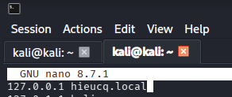

Đưa dữ liệu của website vào lưu trữ website trong `/var/www/`
	
Chỉnh sửa config trong file `/etc/apache2/sites-available/000-default.conf`

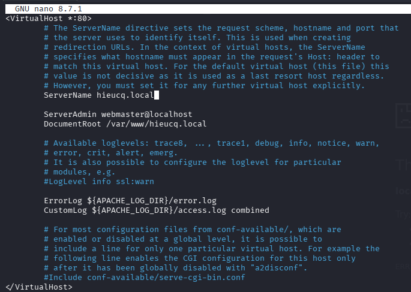

ở dòng `<VirtualHost *:80>` có nghĩa là sẽ lắng nghe từ mọi IP ở port 80

ServerName là domain của website

ServerAdmin là mail của admin , mang tính chất là khi server lỗi thì sẽ raise ra cho user

DocumentRoot là nơi chứa src code của website

```bash
sudo systemctl restart apache2
sudo systemctl status  apache2    
```
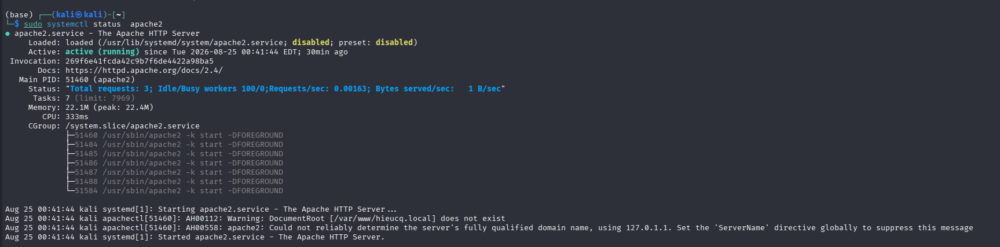

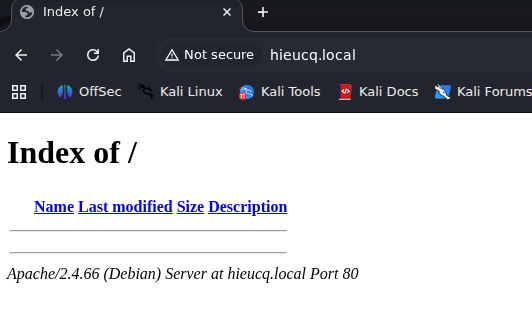

# 1.2. Cấu hình 1 website sử dụng 1 tên miền – 1 IP – nhiều port khác nhau

như ở bên câu trên có giải thích về `<VirtualHost *:80>` , để có thể chạy ở nhiều port thì sẽ thêm : `*:<port>` 
```
<VirtualHost *:80 *:2413 *:2516>
```
và sửa file `/etc/apache2/ports.conf` để listen các port mới vì nó mặc định là nghe ở port 80

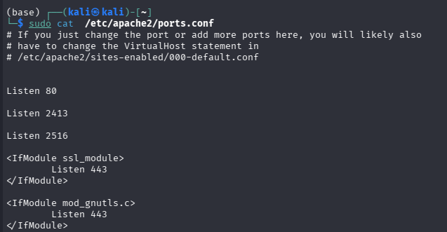

sau khi thêm thì ta restart service
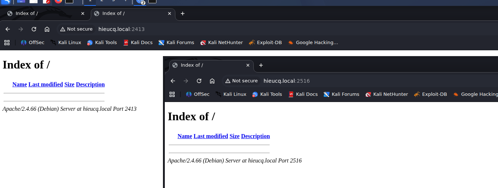

# 1.3. Cấu hình nhiều website sử dụng 1 tên miền – 1 IP – nhiều port khác nhau
đầu tiên ta tiến hành cấu hình trong `/etc/hosts` để ánh xạ domain với ip , sau đố tạo các folder web trong document root

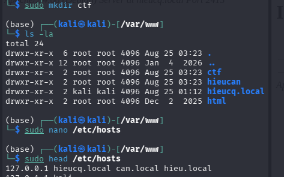

Tạo nhiều thẻ `<VirtualHost>` trong file, mỗi thẻ tương ứng với một website bao gồm ServerName và DocumentRoot của site đó ở file `/etc/apache2/sites-available/000-default.conf `
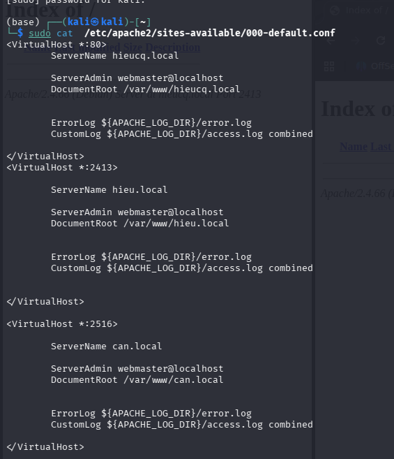

sau khi thêm thì ta restart service

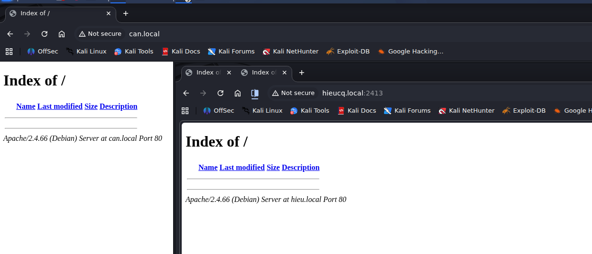

# 1.4. Cấu hình nhiều website sử dụng nhiều tên miền – 1 IP – 1 port
bước đầu giống như ở phần “cấu hình nhiều website sử dụng 1 tên miền – 1 IP – nhiều port khác nhau”

Tạo các file config cho từng website trong thư mục `/etc/apache2/site-availables` với ServerName và DocumentRoot tương ứng

`/etc/apache2/sites-available/` chứa các file cấu hình VirtualHost  mà Apache có thể sử dụng.

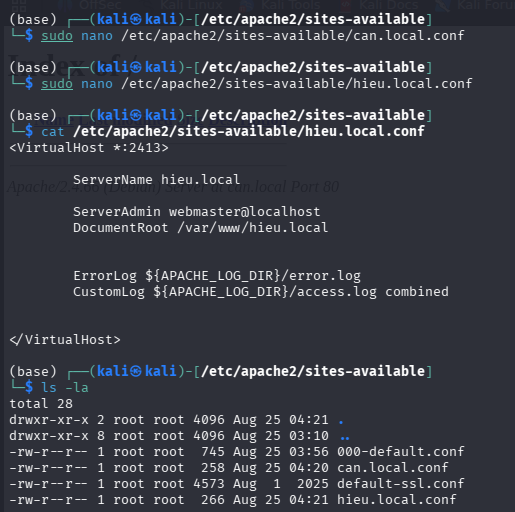

Dùng a2ensite để enable các website

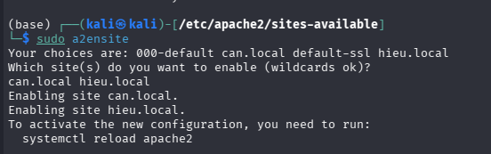
sau khi thêm thì ta restart service

# 1.5. Cấu hình nhiều website sử dụng 1 tên miền – 1 IP – 1 port
ở phàn này thì ta tiến hành dựng 1 domain chính , và sau đó là các subdomain
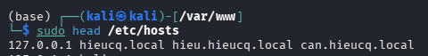

Ta sẽ sửa lại ServerName của 2 cái sau ở dạng có thêm subdomain

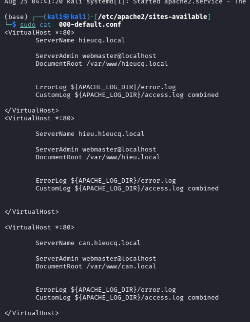


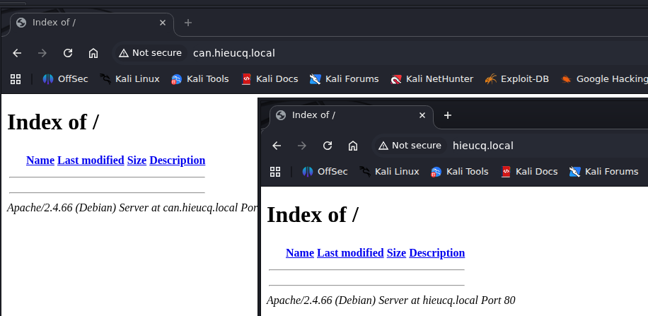

# 1.6 Web Server là gì? Vai trò và cách thức hoạt động của Web Server? Các loại Web Server thường gặp.

## Định nghĩa
Web server là một phần mềm hay máy tính được thiết kế để tiếp nhận và xử lý request HTTP/HTTPS từ clients và trả về tài nguyên tương ứng.
## Vai trò và cách thức hoạt động

### Vai Trò
Nhận và xử lý HTTP/HTTPS request
- Nhận request từ client (browser, curl, API client)

Hiểu các thành phần và xử lí:
- Method (GET, POST…)
- URL
- Header
- Body


Trả về các responses về máy client như :
- Status code (200, 301, 404, 500…)
- Header (Set-Cookie, Content-Type…)
- Body (HTML, JSON, file…)

Phục vụ nội dung tĩnh (static content) như HTML, css, javascript

Chuyển tiếp request cho application (dynamic content)


### Cách thức hoạt động
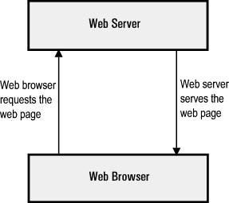

1. Trình duyệt phân giải tên miền thành địa chỉ IP
* Sau khi Client truy cập vào 1 website ví dụ `hieucq.local` thì nó sẽ phân giải ra địa chỉ IP vd như là `1.2.3.4`
* Lúc này trình duyệt web đã biết địa chỉ IP của trang web, nó có thể yêu cầu URL đầy đủ từ webserver.

2. Webserver gửi lại client Trang được yêu cầu
* Web server phản hồi bằng cách gửi lại những thông tin client yêu cầu. Nếu trang không tồn tại hoặc có lỗi khác xảy ra, nó sẽ gửi lại thông báo lỗi thích hợp.


3. Trình duyệt hiển thị trang web
* Trình duyệt web của bạn nhận lại được các tập tin html css (nhiều file khác)… và render hiển thị trang theo yêu cầu.


## Các loại Web Server thường gặp
- Apache HTTP Server: Web server mã nguồn mở, miễn phí, được phát triển bởi Apache Software Foundation. Hỗ trợ Linux, Windows, Unix, macOS và có khả năng cấu hình linh hoạt.

- Nginx: Web server nhẹ, hiệu suất cao, tiêu thụ ít tài nguyên. Ngoài web server, Nginx còn được sử dụng làm Reverse Proxy và Load Balancer. Hỗ trợ HTTPS, Virtual Host, IPv6,...

- IIS (Internet Information Services): Web server do Microsoft phát triển, chủ yếu sử dụng trên Windows Server. Hỗ trợ Web Server, FTP và tích hợp tốt với ASP.NET.

# 1.7 Web Application là gì? Vai trò và cách thức hoạt động của Web Application? Các loại Web Application thường gặp.

## Web Application là gì?

Web Application là ứng dụng chạy trên server và được người dùng truy cập, tương tác thông qua trình duyệt web theo mô hình Client–Server.

## Vai trò và cách thức hoạt động của Web Application

### Vai trò

- Cung cấp chức năng và logic xử lý cho người dùng
- Xử lý dữ liệu và nghiệp vụ
- Tương tác với database hoặc các dịch vụ khác
- Tạo dynamic content dựa trên request và dữ liệu

### Cách thức hoạt động

1. Người dùng thao tác trên trình duyệt
2. Trình duyệt gửi HTTP/HTTPS request đến server
3. Request được chuyển đến Web Application
4. Web Application xử lý logic và có thể truy vấn database
5. Web Application tạo response
6. Server trả HTTP/HTTPS response về trình duyệt
7. Trình duyệt xử lý và hiển thị kết quả

## Các loại Web Application thường gặp

| Phân loại               | Ví dụ tiêu biểu                                                                                                    |
| ----------------------- | ------------------------------------------------------------------------------------------------------------------ |
| Theo ngôn ngữ/framework | PHP (Laravel, Symfony), Java (Spring Boot), Python (Django, Flask), Node.js (Express, NestJS), .NET (ASP.NET Core) |
| Theo kiến trúc hệ thống | Monolithic Application, Microservices Architecture                                                                 |
                                                   |

## Mối quan hệ giữa Web Server và Web Application

Web Server và Web Application thường hoạt động cùng nhau để xử lý request từ người dùng.

- Web Server:
  - Nhận HTTP/HTTPS request từ client.
  - Phục vụ trực tiếp các tài nguyên tĩnh như HTML, CSS, JavaScript, ảnh.
  - Chuyển các request cần xử lý logic đến Web Application.
  - Nhận kết quả từ Web Application và trả response cho client.

- Web Application:
  - Xử lý logic nghiệp vụ.
  - Xử lý dữ liệu người dùng gửi lên.
  - Tương tác với database hoặc các dịch vụ khác.
  - Tạo nội dung động hoặc dữ liệu trả về cho client.

### Luồng hoạt động
```
Client/Browser
      |
      | HTTP/HTTPS Request
      v
Web Server
      |
      | Chuyển request
      v
Web Application
      |
      | Query / Update
      v
Database
      |
      v
Web Application
      |
      v
Web Server
      |
      | HTTP/HTTPS Response
      v
Client/Browser
```
### Cách giao tiếp giữa các bên

- Client ↔ Web Server:
  - HTTP hoặc HTTPS

- Web Server ↔ Web Application:
  - HTTP
  - Reverse Proxy
  - FastCGI
  - ...

- Web Application ↔ Database:
  - Thông qua database protocol hoặc driver
  - Ví dụ: MySQL, PostgreSQL, MongoDB,...

### Ví dụ
```
Browser
   |
   | HTTPS
   v
Nginx
   |
   | Reverse Proxy HTTP
   v
Django Application
   |
   | PostgreSQL Protocol
   v
PostgreSQL Database
```
